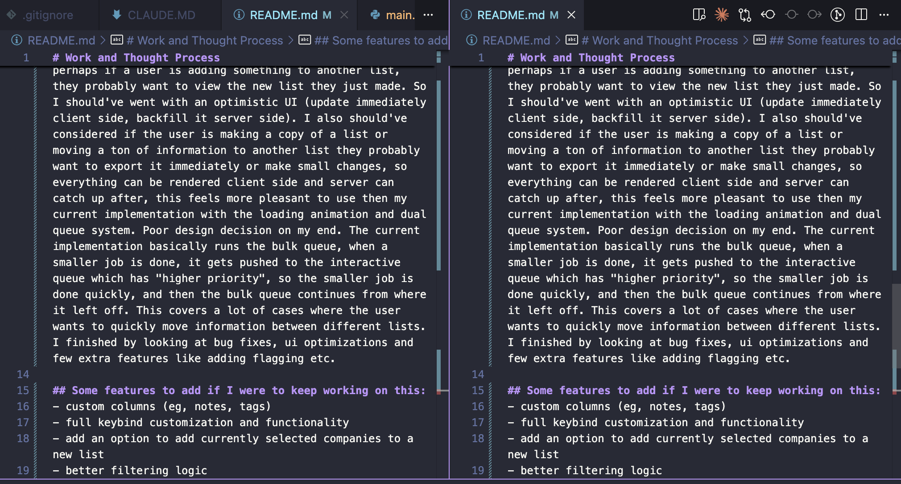

# Work and Thought Process

I started this assignment analyzing the stack, and thinking about the user's flow when working with the interface. what would it look like? I looked originally on if I could optimize the backend to bypass the row level write throttle. Which included batching, and parallelization. 

I then considered that if the user wanted to move a ton of items to one list etc, they wouldn't really need to view all these items which led me to the 2 queue system (or priority queue system). One was for non bulk aka "interactive queue" actions (anything less than 500 row inserts) and one for bulk actions or the "bulk queue". I decided to use redis with celery as it scales well horizontally, redis has pretty simple infra and this combo works really well with the fast api python backend. An alternative that I considered was RabbitMQ but I hadn't used it as much before and read it has more overhead to set up but has better handling of backpressure and more durability. I also used axios, pretty straightforward decision to make the HTTP calls, it has more features than native fetch.

Once this was decided, it was about looking at the details of the queue itself, how would you remove duplicates (settled on using redis set difference), how would you stop the queue (originally considered a sigterm but realized that completely stops all workers so decided to just have a redis flag every 50 inserts which doesn't add a lot of overhead), how are we loading the data for the user to see (I considered infinite scroll but in my mind I imagine that having pages makes it easier for the user to remember they saw a company on page 8 and can go back to it). Also considered adding undo button later on so how would that get tagged to actions in queue. I also enriched the company data to make it more appropriate for sample user display later on (enriched with funding round, team size, year founded etc). 

I then moved onto the actual design of the display. What would the UI/UX look like? A dashboard with a sidebar, footer, navbar in a chart seemed the most appropriate as you could display the most information in a concise and straightforward way which is adopted by most saas tools. This is where I looked on tweakedcn for a colour scheme I liked (purple looks nice although it doesn't fully match the harmonic logo colours oops) and decided to not use material UI and instead use shadcn for more customization. Even though there is some great out of box components such as the datagrid component that comes with pagination in MUI. I thought it was ugly and wanted to make my own. I did also consider that a chart/grid style layout was probably the most straightforward and easy to work with look for displaying the company data that a user could use. 

I then added indices to the company and collection id foreign keys for faster lookup later on, i tried to ensure everything outside the database throttle was optimized. I then started with the layout, colour/design, adding the buttons and features I thought a user would need to get a solid looking mvp. This included search, sort, filter, select rows, show/hide columns, sidebar stuff, export etc. Some stuff like the export don't work but the filter and sort logic works well. 

I then implemented backend related features I thought were important. Examples: cancelling an operation, undo, adding collections, deleting a collection, deleting a company, lot of time was spent here adding a backend feature and hooking up the endpoints with the frontend. Optimizing the 2 queue system. I realized somewhere at this point that perhaps if a user is adding something to another list, they probably want to view the new list they just made. So I should've went with an optimistic UI (update immediately client side, backfill it server side). I also should've considered if the user is making a copy of a list or moving a ton of information to another list they probably want to export it immediately or make small changes, so everything can be rendered client side and server can catch up after, this feels more pleasant to use then my current implementation with the loading animation and dual queue system. Poor design decision on my end. The current implementation basically runs the bulk queue, when a smaller job is done, it gets pushed to the interactive queue which has "higher priority", so the smaller job is done quickly, and then the bulk queue continues from where it left off. This covers a lot of cases where the user wants to quickly move information between different lists. I finished by looking at bug fixes, ui optimizations and few extra features like adding flagging etc.

## Some features to add if I were to keep working on this:
- enrich the data, implement some features within the sidebar
- Feature flags to roll out optimistic UI and new queues safely
- Testing
- custom columns (eg, notes, tags)
- full keybind customization and functionality
- add an option to add currently selected companies to a new list
- better filtering logic
- have a deep clone copy of the list when a user bulk moves items and update that (optimistic UI)
- should also be able to collapse the sidebar
- fuzzy and semantic company searching
- ai recommendations for companies to add
- change # of rows displayed per page
- kanban style dragging features to rearrange rows/columns etc
- double pane view (see example image below for reference):

## Forgot to show in Loom Video
(When selecting an item, there is a small menu that appears with some actions that can be taken besides "add to collection")
- delete specific rows
- select items and flag them
